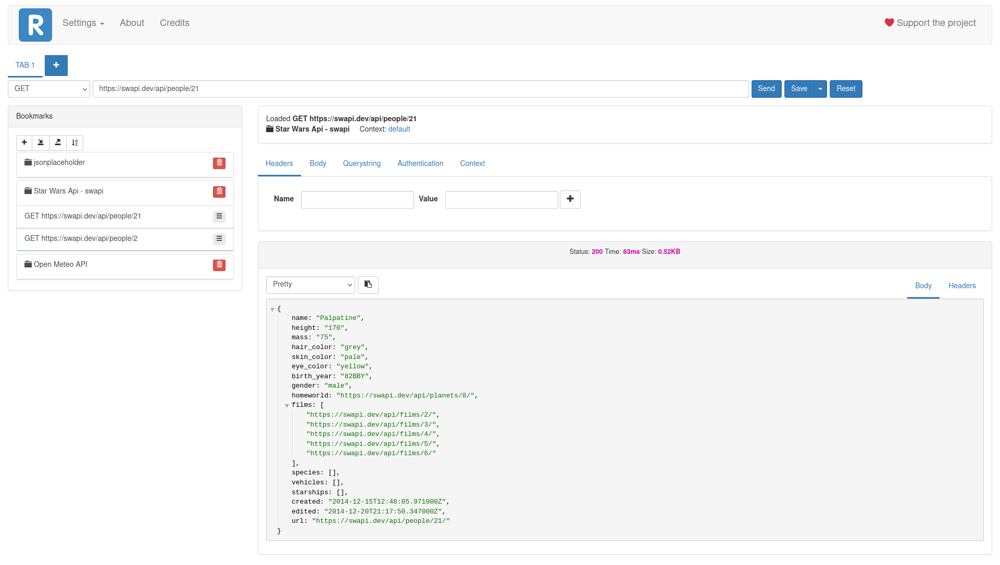

Resting is a visual HTTP client browser extension.

## Mission
The mission of Resting is to simplify the daily work of developer in debugging, testing and inspecting HTTP APIs.

The goal of Resting is to be light, uncluttered and offline-first.

## Main Features

### Request
* Support multipart, x-www-form-urlencoded, raw data request body, file upload.
* BASIC, OAuth2.0, JWT  Authentication.
* Work with multiple requests using Tabs.
* HTTP headers auto-completion.

### Response
* Highlight the response.
* Navigate JSON response.
* Copy to clipboard.
* View response headers.

### Contexts and variables
* Define variables to generalize part of the request.
* Organize variables into contexts.

### Bookmarks
* Save requests as bookmarks.
* Collect bookmarks into folders.
* Import/Export your bookmarks.

## Privacy
Data is yours.
Resting doesn't save in any servers data about the APIs you invoke or any other data about the usage of Resting.
Everything is stored offline on your device, all the data is saved locally in the Indexed DB of your browser.

## Roadmap
This is the road to Resting v2.0

- [x] Support file uploading [#53](https://github.com/mirkoperillo/resting/issues/53)
- [ ] Complete Oauth2.0 authentication [#110](https://github.com/mirkoperillo/resting/issues/110)
- [x] Headers completion suggestion [#52](https://github.com/mirkoperillo/resting/issues/52)
- [ ] List available context variables fo the request [#114](https://github.com/mirkoperillo/resting/issues/114)

## Quickstart

### Official releases

Resting is available for:
* [Mozilla Firefox](https://addons.mozilla.org/en-US/firefox/addon/resting?utm_source=github.com)
* [Google Chrome](https://chrome.google.com/webstore/detail/resting/egklacbpeeiooeclkpghepnohaidpeok)

### Test development version 

You can install Resting from the source code following these instructions:

1. `git clone https://github.com/mirkoperillo/resting.git`
2. `cd resting/scripts && ./build-unsigned.sh <firefox|chrome>` or `cd resting/scripts && ./build-unsigned.ps1 <firefox|chrome>` if you are using windows
3. Go to the addons page in Firefox and click `Install Add-on From File`

### Setup a development environment

#### Requirement
* You need Firefox Dev Edition.
* npm.

#### Steps
1. `git clone https://github.com/mirkoperillo/resting.git`
2. Run `npm install`
3. Run `npm run dev:firefox` (hot-reload enabled)
4. Open Firefox Dev Edition
5. Visit url `about:debugging`
6. Load temporary Addon
7. Navigate your filesystem and select the manifest file in folder `resting/build`
8. The addon is loaded in the toolbar

## Tech Stack
* Knockout.js 3.x: MVVM framework
* Vuejs 2.6
* Bootstrap 3.x: UI framework
* highlight.js: response highlighter
* localforage: storage manager
* JQuery 3.x:  essentially used to perform http requests

## Principles
Resting tries to follow these principles:
* KISS and YAGNI, trying to maintain project light in code and libraries
* Keep the focus on result: the development cycle is composed by two steps: the first takes deliberately technological debt to ship features in a quick way, the second applies a phase of refactor to maintain the code clean.

The project follows the semantic versioning

## Contribution

* Use it! :smiley:
* Star the project :star2:
* Signal a bug
* Suggest a new feature or an improvement of an existing one
* Put a :+1: on a feature or an improvement. Issues with a lot of votes will be put on the top of the TODO list.
* Donate a cup of coffee: [paypal](https://www.paypal.me/owlcodesw) | [liberapay](https://liberapay.com/mirkoperillo)

## Contributors

Project contributors [here](CONTRIBUTORS.md)

## License

Resting is released under GPL v3 license after commit [117e15a33e97bc9c0905139ca527398e77e79620](https://github.com/mirkoperillo/resting/commit/117e15a33e97bc9c0905139ca527398e77e79620)

Resting was released under MIT license until [v1.0.2](https://github.com/mirkoperillo/resting/releases/tag/1.0.2)

### Why I changed license

I know Resting will never be a breakdown project, it is only a personal project and so the license change is only an ethical-political action.

I created Resting to solve my needs and to help users with needs like mine. My intent is to create a little community of users and contributors around the project to grow it up and so I want the project to stay free and accessible forever even when I will be no longer the main maintainer.
